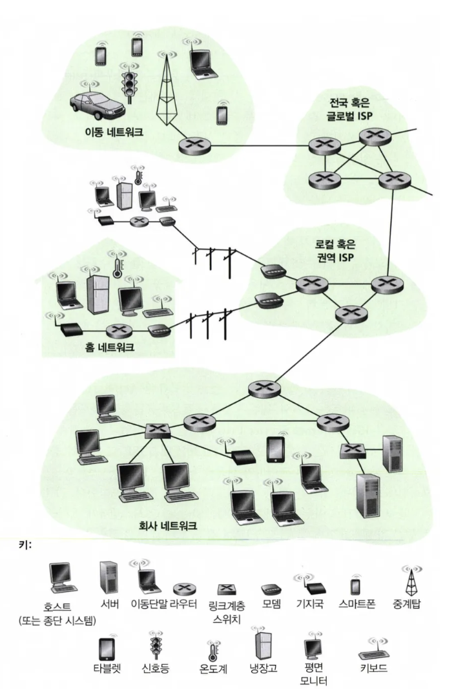
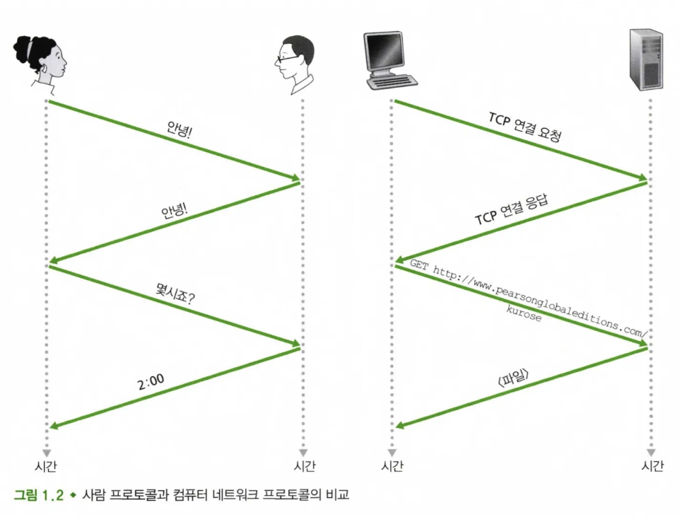

## 1.1.1 구성요소로 본 인터넷

- 종단시스템

  인터넷이란 결국 수많은 컴퓨터와 장비들이 서로 연결되어 있는 구조다.  그 중심에는 **종단 시스템**이라는 개념이 있다. 우리가 흔히 사용하는 스마트폰, 노트북, 서버 등이 모두 종단 시스템에 해당한다. 이 시스템들은 **통신 링크**와 **패킷 스위치**로 구성된 네트워크를 통해 서로 연결되어 있다.

- 통신 링크

  통신 링크는 도로라고 생각하면 쉽다. 이 도로를 통해 데이터라는 차량이 움직이는데, 도로마다 속도가 다르다. 이 속도가 바로 **전송률**이고, 초당 몇 비트의 데이터를 보낼 수 있는지를 나타낸다. 단위는 bps(bit per second)다.

- **패킷(packet)**

  한 종단 시스템이 다른 종단 시스템으로 데이터를 보낼 때, 데이터를 작은 조각들로 나누고 각각에 주소를 붙여 보낸다. 이 조각을 **패킷(packet)**이라고 부른다.

    - 패킷 교환기

      패킷 교환기는 말그대로 최종 목적지로 패킷을 전달해주는 역할 ( 라우터, 링크 계층 스위치가 있다.)

    - 경로(route)

      패킷이 송신 종단 시스템에서 수신 종단 시스템에 도달하는 동안 거친 통신 링크와 패킷 스위치들을 네트워크상의 **경로(route)**라고 한다.

- **ISP(Internet Service Provider)**

  그런데 이렇게 인터넷에 연결되기 위해선 종단 시스템이 혼자선 아무것도 할 수 없다.

  이들을 대신해 연결해주는 존재가 있는데, 바로 **ISP(Internet Service Provider)**다.

  흔히 **KT, SK, LG** 같은 통신사가 여기에 해당한다. ISP는 가정용 인터넷, 고속 LAN, 모바일 데이터 같은 다양한 방법으로 종단 시스템을 인터넷에 연결해준다.

  CP(Content Provider)에게도 연결을 제공하는데, 여기엔 웹사이트나 영상 플랫폼 등이 포함된다.

- 종단 시스템, 패킷 스위치, 인터넷의 다른 구성요소는 인터넷에서 정보 송수신을 제어하는 여러 프로토콜(protocol)을 수행한다.
    - 특히 TCP와 IP는 인터넷에서 가장 중요한 프로토콜이 있는데 → 이게 바로 **TCP/IP**이다.
    - 이처럼 다양한 구성요소들이 원활하게 동작하려면 모두가 같은 규칙을 따라야 하니까, **IETF**라는 조직이 이런 표준을 만들어서 관리하고 있다. 그 결과물이 바로 **RFC 문서**다.

## 1.1.2 서비스 측면에서 본 인터넷

인터넷을 단순히 케이블과 장비들의 연결망으로만 본다면 반쪽짜리 이해다. 인터넷은 다양한 **서비스**를 제공하는 인프라이기도 하다.

애플리케이션은 서로 데이터를 교환하는 많은 종단 시스템을 포함하고 있기 때문에 **분산 애플리케이션**이라고 부른다. 쉽게 말해서 우리가 사용하는 대부분의 앱과 웹사이트는 인터넷 위에서 작동하는 **분산 애플리케이션**이다.

예를 들어, 우리가 스마트폰에서 유튜브 영상을 틀거나, 카카오톡으로 메시지를 주고받는 순간에도 여러 종단 시스템이 데이터를 교환하고 있다. 다시말해서 이들은 네트워크 코어에 있는 패킷 교환기에서 수행되지않고 인터넷 애플리케이션은 종단 시스템에서 수행된다.

### 내가 애플리케이션을 개발하고 있다고 생각해보자

자바나 C로 열심히 개발한 서비스를 어떻게 다른 종단 시스템에서 수행중인 프로그램에게 전달할 것인가?

규칙이 필요하다. 그게 바로 **소켓 인터페이스**다.  송신 프로그램이 따라야하는 규칙의 집합이며, 인터넷은 이 규칙에 따라 데이터를 목적지 프로그램으로 전달한다.

## 1.1.3 프로토콜이란 무엇인가?
  
쉽게말하면 인사 규칙이다.

### 사람으로 생각해보자

당근 거래한다고 생각해보자, 첨보는 사람한테 다짜고짜 물건부터 내밀거나 돈부터 주지는 않을것이다. “혹시 당근이세요?” 라고 한다. 상대방이 “네 당근이에요” 하면 그때서야 거래가 시작된다.

네트워크 통신도 마찬가지다. 어떤 일을 수행하려면 통신 개체가 함께 인식하는 프로토콜 즉 약속이 필요하다.

- 네트워크 프로토콜은 인터넷에서의 모든 활동을 제어한다.
    - 물리적으로 연결된 두 컴퓨터의 네트워크 접속 카드에서 하드웨어로 구현된 프로토콜은 컴퓨터 사이에 연결된 “선로상”의 비트 흐름을 제어한다. (예: 혼잡제아 프로토콜은 송수신자 간에 전송되는 패킷률을 조절)

### URL을 웹페이지에 입력하는 경우를 살펴보자

1. 우리가 웹브라우저에서 URL을 입력하면 먼저 컴퓨터가 연결요청 메시지를 웹서버에 보내고 응답을 기다린다.
2. 웹 서버는 연결 요청 메세지를 받고, 연결 응답 메시지를 우리에게 보낸다.
3. 웹 문서를 요청해도 좋다는 것을 확인하고, 우리의 컴퓨터는 웹 서버에서 얻으려는 웹 페이지 이름을 GET메세지에 넣어서 보낸다.
4. 웹 서버는 컴퓨터로 웹 페이지 내용을 전송한다.

이처럼 프로토콜은 둘 이상의 통신 개체간에 교환되는 메시지 포맷과 순서뿐 아니라, 메시지의 송수신과 다른 이벤트에 따른 행동들을 정의한다.