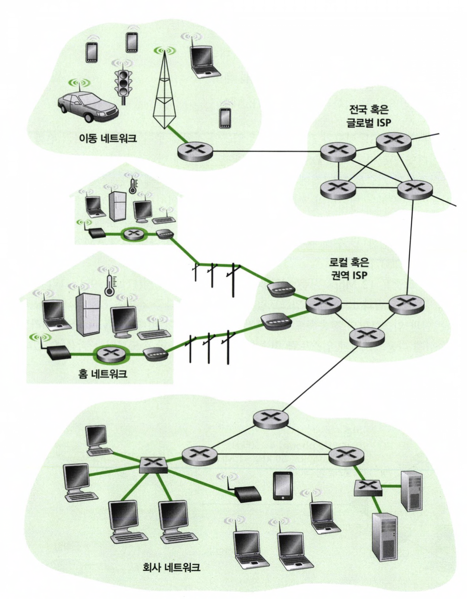

### 종단 시스템 (End System, Host)

인터넷에 연결되는 컴퓨터와 다른 장치를 종단 시스템이라고 부른다. 예를 들어서 테스크톱 컴퓨터, 서버, 모바일 컴퓨터 등을 포함한다.

   

종단 시스템은 웹 프라우저 프로그램, 웹 서버 프로그램, 전자메일 클라이언트 프로그램이나 서버 프로그램 같은 애플리케이션을 수행하므로 호스트라고도 부른다.

## 1.2.1 접속 네트워크

종단 시스템을, 해당 시스템으로부터 멀리 떨어진 다른 종단 시스템까지의 경로상에 있는 첫 번째 라우터에 연결하는 네트워크를 살펴보겠다.

### 가정 접속: DSL, 케이블, FTTH, 다이얼-업 그리고 위성

요즘은 대부분의 가정에서 인터넷 접속이 가능하다. 특히 대한민국은 가정의 80% 이상이 인터넷에 연결되어 있다. 이제 가정이 어떻게 인터넷에 연결되는지 살펴보자.

   

오늘날에는 **DSL(digital subscriber line)**과 **케이블**이 가장 널리 보급된 광대역 접속 유형이다. 가정은 유선 로컬 전화 서비스를 제공하는 같은 지역 전화 회사로부터 DSL 인터넷 접속 서비스를 받는다.

### DSL

   

가정의 DSL 모뎀은 디지털 데이터를 받아서 전화선을 통해 **CO**로 전송하기 위해 고주파 신호로 변환한다. 그리고 여러 가정으로 부터의 아날로그 신호는 **DSLAM**에서 디지털 포맷으로 다시 변환된다.

DSL 표준은 [**ITU 1999], [ITU 2006]**의 다중속도 정의를 하는데, **다운스트림**과 **업스트림**의 전송속도가 다르기 때문에 접속이 비대칭이라고한다.

### 케이블

   

**DSL**은 **전화선** 기반 인프라를 이용하여 인터넷 접속을 제공한다.

반면, **케이블 인터넷 접속**은 **케이블 TV 서비스**를 제공하는 회사로부터 인터넷 서비스를 제공받는다.

케이블 인터넷을 이용하려면 **케이블 모뎀**이 필요하다.

케이블 모뎀은 보통 외장형 장치이며, 이더넷 포트를 통해 가정용 PC와 연결된다.

이는 DSL 모뎀의 구조와 유사하다.

케이블 네트워크의 중심에는 **CMTS**(Cable Modem Termination System)가 설치된다.

CMTS는 DSL 네트워크의 **DSLAM**과 유사한 기능을 수행하며,

가정 내 케이블 모뎀에서 송신된 아날로그 신호를 수신하여 디지털 신호로 변환한다.

케이블 인터넷은 **공유 매체**를 사용한다는 점에서 특징이 있다.

헤드엔드가 전송하는 모든 패킷은 다운스트림 채널을 통해 연결된 모든 가정으로 동시에 전달된다.

따라서, 여러 사용자가 동시에 데이터를 수신할 경우,

**전체 다운스트림 전송 속도**를 여러 가정이 나누어 사용하게 되어, **개별 사용자의 수신 속도**는 감소한다.

결국, 케이블 인터넷은 인프라 구조상 많은 사용자가 동시에 접속하면 성능이 저하될 수밖에 없는 특성을 가진다.

### FTTH(fiber to the home)

FTTH는 광대역 접속의 미래 기술이다. 이름이 시사하는 바와 같이 CO에서 가정까지 직접 광섬유로 경로를 제공한다.

광신호를 분배하는 여러 경쟁적인 기술들이 있는데 가장 간단한 광신호 분배 네트워크는 각 가정으로 CO에서 하나의 광섬유를 제공하는 **다이렉트 광섬유**가 있다.

보다 공통적으로, CO 에서 시작되는 각 광섬유는 여러가정이 공유한다.

이러한 스플리팅을 수행하는 두 가지 경쟁적인 광신호 분배 네트워크가 있는데 이는 AON(active optical network)과 PON(pasive optical network)이다.

   

위 그림은 PON 분배구조를 이용하는 FTTH 이다. 각 가정은 ONT를 갖고 있으며, 이는 지정된 광섬유로 이웃 스플리터에 연결된다. 스플리터는 여러가정을 하나의 광섬유로 결헙하고 이를 CO에있는 OLT에 연결한다.

### 기업 접속(그리고 가정): 이더넷과 와이파이(WIFI)

LAN(local area network) 은 일반적으로 종단 시스템을 가장자리 라우터에 연결하기 위해 사용된다. 여러 유형의 LAN 기술이있지만 그중에서도 이더넷이 가장 널리 사용되는 접속 기술이다.

이더넷은 이더넷 스위치 혹은 상호연결된 스위치들의 네트워크는 이제 다시 더 큰 인터넷으로 연결된다.

   

무선 랜 환경에서  무선 사용자들은 기업 네트워크에 연결된 AP로 패킷을 송신/수신하고, 이 AP는 유선 네트워크에 다시 연결된다. 무선 LAN 사용자들은 일반적으로 AP의 수십 미터 반경에 있어야한다.  IEEE 802.11 기술에 기반한 무선 LAN 접속은 와이파이라고 더 잘 알려져있다.

### 광역 무선 접속:3G와 LTE

이동 전화망 사업자들이 운영하는 기지국을 통해 패킷을 송수신하난 데 사용하는 것과 같은 무선 기반구조를 채택하고 있다. 와이파이와 달리 사용자는 기지국의 수십 km 반경 내에 있으면 된다.

   

## 1.2.2 물리 매체

물리 매체에 대해 이해하기 위해 비트에 대해 알아보자.

한 종단 시스템에서 여러 링크와 라우터를 거쳐 다른 종단 시스템으로 한 비트가 전달되는 것을 생각해보면 이 비트는 여러 번에 걸쳐 전송된다.

비트가 출발지에서 목적지로 전달될 때, 일련의 송신기-수신기 쌍을 거친다. 각 송신 -수신기 쌍에 대해, 이 비트는 물리매체상에 전자파나 광 펄스를 전파하여 전송한다. 물리 매체는 여러 형태이며 경로상의 각 송신기-수신기 쌍에 대해 같은 유형일 필요는 없다.

꼬임쌍선, 동축케이블, 다중모드 광섬유 케이블 등이 물리매체의 예이다.

물리매체는 유도 매체와 비유도 매체로 다시 나눌 수 있다.

- 유도 매체 : 광섬유 케이블, 꼬임쌍선, 동축 케이블 (견고한 매체따라 파형 유도)
- 비유도 매체 :무선 LAN, 디지털 위성 채널(대기와 야외 공간으로 파형 전파)

### 꼬임쌍선

가장 싸고 가장 많이 이용하는 전송 매체가 꼬임쌍선이다. 특히 전화망에서 이용한다.

2개의 절연 동선이고 나선 형태로 배열되어있다.

UTP는 빌딩의 컴퓨터 네트워크, 즉 LAN에 가장 많이 이용하는 매체이다.

### 동축케이블

꼬임쌍선 처럼 2개의 구리선으로 되어있지만 평행하지않고 동신원 형태이다.

꼬임쌍선보다 더 높은 데이터 전송률을 얻을 수 있다.

동축케이블은 유도 공유 매체로 사용할 수 있다.

### 광섬유

광섬유는 비트를 나타내는 빛의 파동을 전하는 가늘고 유연한 매체이다.

송신기, 수신기, 수위치 등의 광 장비는 고가이므로 랜이나 가정처럼 근거리 전송에는 이용하기 어렵다.

### 지상 라디오 채널

라디오 채널은 전자기 스펙트럼으로 신호를 전달한다.

물리 선로 설치할 필요가 없고, 벽을 관통할 수 있으므로 이동사용자에게 연결성을 제공하고 먼거리싸지 신호를 전달할 수 있다는 가능성 때문에 매력 있는 매체이다.

### 위성 라디오 채널

위성은 한 주파수 대역으로 전송신호를 수신하고 리피터를 이용하여 그 신호를 재생하며, 그 신호를 다른 주파수 대역으로 전송한다.

수백 Mbps의 속도로 작동하는 위성 링크는 DSL 접속이나 케이블 인터넷 접속을 할 수 없는 지역에서 주로 이용된다.