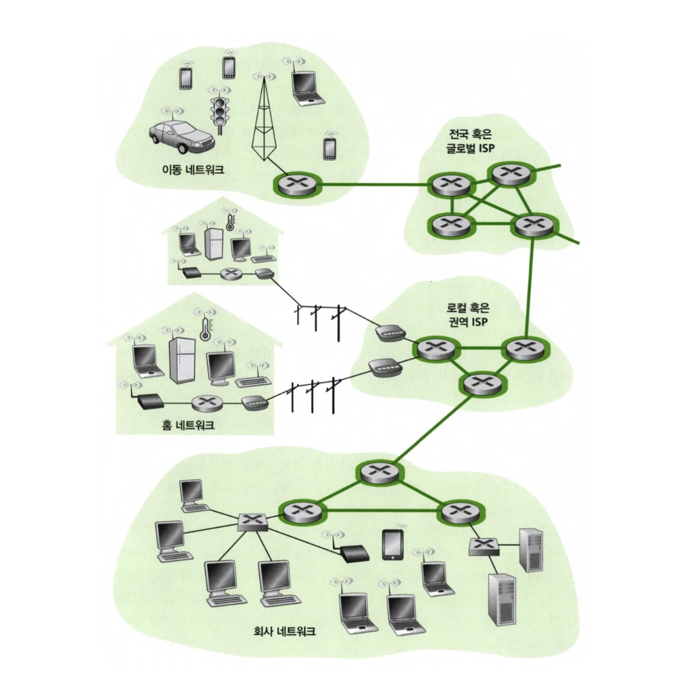
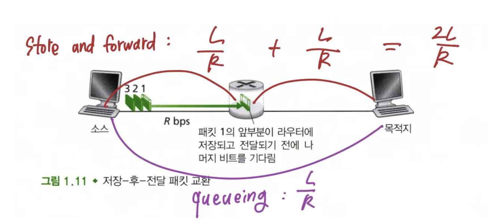
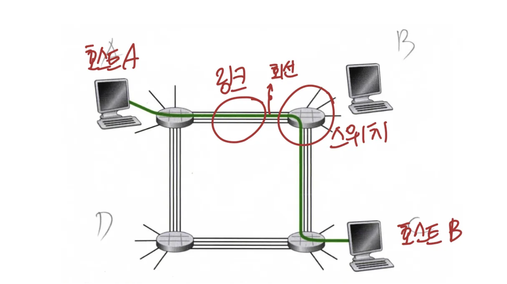
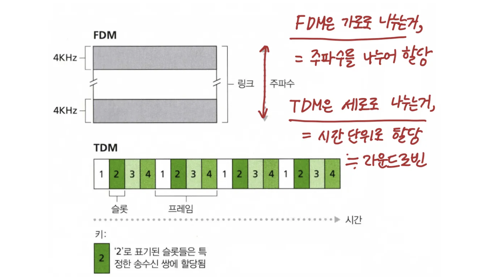
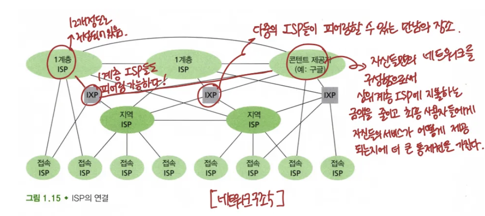

이번 장에서는 종단 시스템을 연결하는 **패킷 스위치** 들과 **링크들의 연결망(mesh)** 을 좀 더 자세히 살펴보겠다.

   

## 1.3.1 패킷 교환

네트워크 응용에서 종단 시스템들은 서로 메세지를 교환한다. 메세지는 제어기능(ack, synk) 혹은 전자메일, jpg 같은 이미지 파일과 같은 데이터를 포함한다.

메세지를 송신하는 종단시스템에서 목적지 종단 시스템으로 메세지를 보내기 위해, 송신 시스템은 긴 메세지를 **패킷** 이라고 하는 작은 조각들로 분할한다.

이 작은 조각인 패킷은 통신링크와 패킷 스위치를 거치게 된다.

- 패킷은 링크의 최대 전송 속도와 같은 속도로 각각의 통신 링크 상에서 전송된다.
- 패킷전송시간 : 패킷 스위치가 ***R* bits/sec** 의 속도로 ***L* bits** 의 패킷을 송신하면 **L/R 초**

### 저장-후-전달

대부분의 패킷 스위치는 **저장-후-전달 전송(store-and-forward transmission)방식** 을 이용한다.

**저장-후-전달은** 스위치가 출력 링크로 패킷의 첫 비트를 전송하기 전에 전체 패킷을 받아야 함을 의미한다.

라우터의 기능이 입력되는 패킷을 출력 링크로 교환하는 것이기 때문에 보통 여러개의 링크를 갖는다.

   

위의 예시를 통해 살펴보자.

1. 송신 시스템이 *L/R* 초 시간에 전체 패킷을 전송하였고 전체 패킷이 라우터에 수신되고 저장되었다.
2. *L/R* 초 시간에 라우터가 전체 패킷을 수신했기 때문에 라우터는 수신 시스템을 향해 출력 링크로 전송하기 시작한다.
3. 그 결과 2*L/R* 기간에 라우터는 전체 패킷을 전송하였고 수신시스템이 전체 패킷을 수신하였다.
4. 따라서 전체 지연은 2*L/R*이다.

이제 소스가 첫 번째 패킷을 송신하기 시작한 순간부터 목적지 노드가 3개의 모든 패킷을 수신할 때까지의 경과된 전체 시간을 계산해 보자.

1. 송신 시스템이 *L/R* 초 시간에 첫 번째 패킷을 전송하기 시작한다.
2. 그러나 L/R 시간에 소스도 첫 번째 패킷 모두를 송신했기 때문에 두 번째 패킷을 송신하기 시작한다.
3. 따라서 2L/R 시간에 목적지 노드는 첫 번째 패킷을 수신하게되고 라우터는 두 번째 패킷을 수신한다.
4. 마찬가지로 3L/R 시간에 목적지 노드는 처음 2개의 패킷을 수신하게 되고, 라우터는 세 번째 패킷을 수신한다. 마지막으로 4L/R 시간애 목적지는 3개의 모든 패킷을 수신한다.

소스로부터 목적지 노드까지 **N**개의 링크로 구성되고, 각각은 **R** 전송속도를 갖는 경로를 통해 하나의 패킷을 전송하는 일반적인 경우를 고려하면 종단간 지연시간은 다음과 같다.

$$
N \frac{L}{R}
$$

### 큐잉 지연과 패킷 손실

각 패킷 스위치는 접속된 여러 개의 링크를 갖고 있다. 각 링크에 대해 패킷 스위치는 출력 버퍼를 갖고 있으며, 그 링크로 송신하려고 하는 패킷을 저장하고 있다.

출력 버퍼는 패킷 스위칭에서 중요한 역할을 한다. 도착하는 패킷이 한 링크로 전송될 필요가 있는데 그 링크가 다른 패킷을 전송하고 있다면, 도착하는 패킷은 출력 버퍼에서 대기해야 한다.

따라서 저장-후-전달 지연에 더해서 **큐잉 지연** 을 겪게 된다.

버퍼의 크기가 유한하기 때문에 패킷이 도착했을때 이미 버퍼가 다른 패킷들로 꽉 차있을 수 있다. 이때 **패킷 손실** 이발생한다.

### 전달 테이블과 라우팅 프로토콜

라우터는 어떻게 패킷을 어느 링크로 전달하는지 결정할까?

인터넷에서 모든 종단 시스템은 IP 주소라고 하는 주소를 갖는다.

소스 종단 시스템이 패킷을 목적지 종단 시스템으로 보내고자 할 때, 소스는 패킷의 헤더에 목적지의 IP 주소를 포함한다.

패킷이 한 라우터에 도착하면, 라우터는 패킷의 목적지 주소의 일부를 조사하고 그 패킷을 이웃 라우터로 전달한다.

각 라우터는 지도같이 목적지 주소를 라우터의 출력 링크로 매핑하는 **전달 테이블(forwarding table)** 을 갖고있다.

이를 이용해서 패킷이 라우터에 도착하면 라우터는 목적지 주소를 분석하고 그 주소를 이용해서 전달 테이블을 검색한다. 그리고 검색 결과를 이용해서 해당 패킷을 출력 링크로 보낸다.회선 교환 : 전통적인 전화

라우팅 프로토콜이 각 라우터로부터 각 목적지까지의 최단 경로를 설정하고 이 결과를 라우터에 전달 테이블을 설정하는데 이용한다.

## 1.3.2 회선 교환

링크와 스위치의 네트워크를 통해 데이터를 이동시키는 방식에는 **회선 교환(circuit switching)** 과 **패킷 교환(packet switching)** 이라는 두 가지 기본 방식이 있다.

**회선 교환(circuit switching)** 은 예약을 받는 레스토랑, **패킷 교환(packet switching)** 은 예약을 받지 않는 레스토랑이라고 이해하면 된다.

   

위의 예시를 통해 살펴보면 호스트 A가 호스트 B와 통신하기 위해 네트워크는 먼저 2개의 링크 각각에 한 회선을 예약한다.

각 링크는 4개의 회선을 가지므로, 종단간 연결을 사용하는 각 링크에 대해, 그 연결은 전체 전송 용량의 1/4을 얻는다.

예를 들어 각 링크가 **1Mbsp** 의 전송 속도를 갖는다면, 각 종단간 회선 교환 연결은 지정된 전송속도의 **250 kbps**를 얻게된다.

### 회선 교환 네트워크에서의 다중화

링크 내 하나의 회선은 주파수-분할 다중화 (FDM) 또는 시-분할 다중화(TDM)로 구현된다.

**FDM**에서 링크를 통해 설정된 연결은 그 링크의 주파수 스펙트럼을 공유한다. 특히 링크는 연결되는 동안 주파수 대역을 고정 제공한다.

이러한 주파수를 **대역폭(bandwith)** 이라고 한다.

**TDM 링크**는 시간을 일정 주기의 프레임으로 구분하고 각 프레임은 고정된 수의 시간 슬롯으로 나뉜다.

네트워크가 링크를 통해 하나의 연결을 설정할 때, 네트워크는 모든 프레임에서 시간 슬롯 1개를 그 연결에 할당한다.

   

**TDM 회선의 전송률** : 한 슬롯 안의 비트수 x 프레임 전송률

전송 시간은 링크 수와 무관하다.

## 1.3.3 네트워크의 네트워크

인터넷은 단순히 종단 시스템들의 모임이 아니다.

종단 시스템(PC, 스마트폰, 웹 서버 등)이 DSL, 케이블, FTTH 등의 접속망을 통해 인터넷에 연결되는 것은 시작에 불과하다.

진정한 인터넷의 모습은 '네트워크의 네트워크'라는 개념에서 찾을 수 있다.

이 거대한 퍼즐을 완성하기 위해서는 접속 ISP들이 서로 연결되어야 한다.

하지만 각 접속 ISP가 전 세계의 모든 다른 ISP와 직접 연결하는 것은 비용 측면에서 현실적이지 않다. 이러한 문제를 해결하기 위해 인터넷은 계층적 구조로 발전했다.

   

가장 상위에는 글로벌 범위의 1-계층 ISP(AT&T, Sprint, NTT 등)가 있다. 이들은 전 세계에 라우터와 통신 링크를 보유하고 있으며, 서로 피어링 관계를 맺어 트래픽을 교환한다.

중간에는 지역 ISP가 있어 특정 지역의 접속 ISP들을 연결하고, 이들은 상위의 1-계층 ISP에 비용을 지불하며 연결된다.

이 구조에서 각 ISP 간의 관계는 '고객-제공자' 또는 '피어링' 관계로 나뉜다.

하위 ISP는 상위 ISP에게 비용을 지불하는 고객이 되고, 같은 계층의 ISP끼리는 비용 없이 트래픽을 교환하는 피어링 관계를 맺을 수 있다.

피어링은 주로 IXP(Internet Exchange Point)라는 특별한 장소에서 이루어진다.

또한 ISP들은 '멀티-홈' 전략을 취하기도 한다.

한 접속 ISP가 두 개 이상의 상위 ISP와 연결하여 서비스 안정성을 높이는 방식이다.

이렇게 하면 한 연결이 끊어져도 인터넷 접속을 유지할 수 있다.

최근에는 Google과 같은 콘텐츠 제공자들이 자체 네트워크를 구축하는 현상도 나타났다. 이들은 전 세계 여러 데이터 센터에 서버를 두고, 1-계층 ISP나 IXP와 직접 연결하여 중간 ISP를 우회함으로써 비용을 절감하고 서비스 품질을 높이고 있다.
오늘날의 인터넷은 약 12개 정도의 1-계층 ISP와 수많은 하위 계층 ISP들로 구성된 복잡한 생태계를 이루고 있다.

이 구조는 단순한 기술적 필요성뿐만 아니라 경제적, 국가 정책적 요인들에 의해 계속 진화하고 있다.