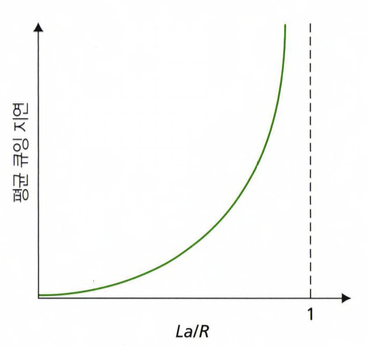

이상적으로 인터넷 서비스가 데이터의 손실 없이 두 종단 시스템 간에 원하는 만큼의 데이터를 이동시키기를 희망하지만, 필연적으로 지연이 생기거나 혹은 패킷을 잃어버리기도 한다.
해당 절에서는 네트워크 상에서의 지연, 손실 그리고 처리량을 알아보자.

### 1.4.1 패킷 교환 네트워크에서의 지연 개요
위에서 두 종단 시스템간에 데이터를 주고 받을 때에는 필연적으로 지연이나 패킷 손실이 발생한다고 말했는데, 그 이유에 대해 먼저 살펴보자.
그러기 위해선 패킷이 출발지 호스트에서 출발하여 목적지 호스트까지 가는 여정을 먼저 살펴봐야겠다.
출발지 호스트에서 출발한 패킷이 일련의 라우터들을 통과하여 목적지 호스트와 가까운 라우터들로 이동하게 되는데 그 **라우터**들을 거치는 과정에서 "지연"이 발생하게 된다.

그 지연 중에는
- 노드 처리 지연
- 큐잉 지연
- 전송 지연
- 전파지연

이 있고 얘네들이 모여서 전체 노드 지연이 일어나게 된다.

   

가장 간단하게 패킷이 라우터를 거쳐 목적지로 이동하는 과정을 살펴보자.
패킷이 라우터 A 에 도착하게 되면 라우터 A 는 패킷의 해더를 조사하여 어디로 패킷을 전송할지 결정하고 거기로 전송해주는 역할을 하는데,
여기서 패킷헤더를 조사할 때 걸리는 지연을 **처리지연** 이라고 한다.

즉, 한마디로 라우터가 헤더를 조사하고 그 패킷을 어디로 보낼지 결정하는 시간이다.

위에서 본 과정은 이미 처리중인 패킷이 없을 때, 라우터의 큐가 비어있을 때에서의 동작과정이었는데, 만약 하나의 라우터에 2개 이상의 패킷이 왔을 때를 생각해보자.

라우터는 한번에 하나의 패킷만을 처리할 수 있기 때문에 큐라고 하는 곳에서 패킷들이 대기하게 된다. 이 지연을 **큐잉지연** 이라고 한다.

즉, 한마디로 대기 중인 큐에서 링크로 전송되기를 기다릴 때 걸리는 시간이다.

이제 패킷을 전송할 준비가 끝났다면 실제로 목적지를 향해 패킷을 밀어내야하는데 그 성능은 링크의 전송률에 달려있다.
예를 들어 200Mbps 이더넷 링크의 경우 전송률 R 은 200Mbps이다. 전송률이란 패킷을 담아 보낼 수 있는 크기라고 생각하면 되는데
나는 200Mbps 만 처리할 수 있는데 1000Mbps 의 패킷을 전송해야한다면 200Mbps 씩 5번 정송해야하므로 여기서 발생하는 **전송지연** 은
L/R (R: 전송률, L: 패킷의 길이) 라고 할 수 있다.

전송지연이라는 것의 이해를 돕기 위해 예시를 들어보자면 총 10명의 승객이 타야 출발하는 버스가 있고, 한명씩 탑승할 수 있으며 승객 1명이 탑승하는데 1초의 시간이 걸린다고 생각해보자. 모든 승객이 탑승하는데 걸리는 시간은 10초. 그러면 10초가 지연된다.

2명씩 탑승할 수 있고, 승객이 탑승할 때 1초가 걸린다면 이번엔 5초 지연이 발생한다.
여기서 지연의 기준은 다른 버스에 새로운 무리의 승객이 탑승하려면 이전 무리의 승객들이 모두 떠나야 탑승을 시작할 수 있다는 가정에서의 지연을 의미한다.

여기까지 오게되면 이제 모든 패킷들이 라우터에서 벗어나 링크에 전해지게 된다.

이제 링크를 타고 패킷들이 이동하면서 생기는 지연을 **전파지연** 이라고 한다. 앞선 예시를 이어서 말해보자면 승객을 모두 태운 버스로 이동하는데 걸리는 시간이라고 할 수 있겠다.
전파 속도는 링크의 물리 매체(광섬유, 꼬임쌍선 등)에 따라 달라지게 되는데, 전파지연은 두 라우터 사이의 거리를 전파속도로 나눈 것이다.
즉, 전파지연은 d/s 이다. d는 라우터 사이의 거리이고 s 는 링크의 전파속도를 의미한다.

위에서 전송지연은 버스에 승객들이 전부 탑승할 때 까지의 시간, 전파지연은 버스로 이동하는데 걸리는 시간이라고 비유했는데 다시 한번 비교를 해보자.
전송지연은 라우터가 패킷을 '내보내는 데' 필요한 시간이다. 두 라우터 사이의 거리와는 관계가 없으며 단순히 출발지 라우터가 패킷을 내보는데 필요한 시간이다.
반면에 전파지연은 비트가 한 라우터에서 다음 라우터로 '전파'되는데 걸리는 시간이다. 두 라우터 사이의 거리에 대한 함수이며 패킷 길이나 링크 전송률과는 무관하다.

이번엔 요금 계산소가 있는 고속도로 예시를 들어 생각해보자. 총 10대의 자동차 대열이 함께 여행을 한다고 가정하고, 100km 마다 요금 계산소가 있으며 차가 시속 100km 로 고속도로를 달리고, 각 요금 계산소는 12초마다 한 대의 차를 서비스한다고 가정해보자.
10대의 자동차는 함께 여행을 하기 때문에 모든 차가 요금 계산소에 도착할 때까지 이전에 도착한 차들은 기다리기로 했다. 전체 차량이 다음 요금 계산소로 전송되기 전에 요금 계산소에 저장된다고 볼 수 있겠다.
모든 자동차가 도착하고 요금 계산소가 전체 차량을 서비스하는데 걸리는 시간은 총 10대, 각 12초이므로 10*12초 = 120초 (2분) 이 걸리게 된다. 이 시간은 라우터에서의 **전송지연**과 유사하다.
요금 계산소를 통과한 자동차가 다음 요금 계산소로 이동하는데에는 1시간이 걸리게 되고 이렇게 이동하는 시간은 **전파 지연**과 유사하다.

조금 더 네트워크에서 일어날 법한 예제를 살펴보자.
만약 자동차의 시속이 1000km 이고 요금 계산소는 1분에 1대를 서비스한다고 해보자. 그러면 요금 계산소 사이의 거리는 100km 이니까 

1000km : 1hr = 100km : x hr
여기서 x = 1/10 (6분)

따라서 요금 계산 소 사이의 이동지연은 6분이 되고 차량들을 서비스하는데 걸리는 시간은 10분이 된다.
이 경우에 처음 몇 자동차는 마지막 자동차가 첫번째 요금 계산소를 벗어나기 전에 두 번째 요금 계산소에 먼저 도착하게 되고 그렇게 되면 다음 자동차가 도착하기를 기다리는 시간들이 다시금 발생하게 된다.
유사한 경우가 패킷 교환 네트워크에서도 발생할 수 있다. 패킷의 앞선 비트들이 나머지 비트가 이전 라우터에서 전송되기를 기다리는 동안에 이미 다음 라우터에 도착할 수 있는 것이다.
그래서 위에서 살펴본 노드지연, 전송지연, 전파지연, 큐잉지연이 모두 합해진 값이 전체 노드 지연을 의미할 수 있게된다.

### 1.4.2 큐잉 지연과 패킷 손실
위에서 살펴본 노드 지연 중 가장 복잡한 요소는 **큐잉 지연**이다. 큐잉 지연을 제외한 다른 세가지 지연과는 다르게 큐잉 지연은 '패킷 마다' 다를 수 있다.
예를 들어서 10개의 패킷이 동시에 비어있는 큐에 도착했다고 하면, 첫 번째 패킷은 비어있는 큐에 도착했으니 지연을 겪지 않지만 뒤에 있는 나머지 9개의 패킷은 전송되기 위해 앞선 패킷들의 노드지연을 경험해야된다. 이런 이유로 패킷마다 겪는 큐잉 지연 시간은 달라질 수 있다.
그러면 언제 큐잉 지연이 크고 언제 작은지에 대한 답을 하기 위해선, 
- 트래픽이 큐에 도착하는 비율
- 링크의 전송률
- 도착하는 트래픽의 특성 -> 트래픽이 주기에 맞춰서 또는 burst 하게 도착하느냐

에 의해 주로 결정이 된다.

패킷이 큐에 도착하는 평균율을 a 라고 해보자. a 의 단위는 패킷/초 가 된다. R 은 전송률(비트가 큐에서 밀려나는 비율(비트/초))라고 하자.
편의상 모든 패킷이 L 비트라고도 가정해보자. 이때 비트가 큐에 도착하는 평균율은 La 비트/초 이고, 큐가 매우 커서 무한대 비트를 저장할 수 있다고 가정한다.

큐잉지연은 트래픽 강도와 관련이 있다고 했는데 트래픽 강도는 큐에 도착하는 평균율을 비트를 전송하는 전송률로 나눈 비율의 의미하겠다. 즉 La/R 가 된다.

잘 생각을 해보면, 트래픽 강도가 1보다 크다는 것은 큐에 도착하는 양이 큐가 비트를 전송하는 양보다 많다는 것이고 그렇게 되면 도착한 비트가 앞의 비트가 전송되기를 대기해야한다는 의미가 될 것이다.
이 경우엔 큐가 끝없이 증가하고 큐잉 지연은 무한대에 도달하게 될 것이다. 그래서 트래픽 공학의 주요 규칙 중 하나는 트래픽 강도가 1보다 크지 않게 시스템을 설계하는 것이 되겠다.

그러면 반대로 트래픽 강도가 1보다 작다는 것은 큐에 도착하는 양보다 큐가 비트를 전송하는 양이 더 많다는 것이고 그렇게 되면 비트가 큐에 도착할 때마다 큐가 비어있는 상태가 된다. 그렇게 되면 큐잉 지연은 발생하지 않는다.

그치만 패킷이 주기적이 아니라 몰려서(burst) 도착한다고 하면 상당한 평균 큐잉 지연이 발생할 것 이다. N개의 패킷이 동시에 (L/R)N 초 마다 도착한다고 하면 처음에 전송된 패킷은 큐잉 지연이 없지만 두번째 전송된 패킷은 L/R 초의 지연을 가질 것이고 이를 일반화 하면 n 번째에 전성된 패킷을 (n-1)L/R 초의 큐잉 지연을 겪을 것이라고 추정할 수 있다.

패킷이 주기적으로 도착한다는 것은 너무 이론적이 이야기이고 일반적으로 패킷이 큐에 도착하는 것은 랜덤하다. 그래서 위에서 살펴본 트래픽과 큐잉지연에 대한 이해는 완전한 분석을 위한 것이라기 보다는 큐잉 지연에 대한 직관적인 이해를 돕는 것이라고 생각하자.
트래픽 강도가 0에 가까우면 패킷 도착이 드물고 평균 큐잉 지연이 0에 수렴하는 것이고 트래픽 강도가 1에 접근할 수록 평균 큐 길이가 점점 증가하고 평균 큐잉 지연이 '급속하게' 증가하게 된다.

   

고속도로에서 발생하는 교통체증을 떠올리면 왜 급속하게 증가하는지에 대한 이해를 도울 수 있을 것 같다. 

조금 더 현실적으로 다가가보자면, 앞에서의 가정은 큐가 무한대의 패킷을 가질 수 있다고 가정했었다. 하지만 현실에서 큐의 용량은 스위치 설계와 비용에 크게 의존하며 일반적으로 '유한한' 용량을 가진다.
앞의 예시와는 다르게 유한하기 때문에 트래픽 강도가 1에 접근한다고 패킷 지연이 무한대가 되진 않는다. 다만, 패킷이 도착했을 때 꽉 차있는 큐를 발견할 수 있을 뿐이다.
이렇게 패킷을 저장할 수 없는 경우에 라우터는 패킷을 **버린다**. 즉 우리의 입장에서는 그 패킷을 **잃어버리게 된다**. 이를 큐에서의 오버플로우라고 하며 트래픽 강도가 1보다 클 때 볼 수 있다.
종단 시스템의 입장에서 패킷 손실은 패킷이 네트워크 코어로 전송되었으나 네트워크로부터 목적지에 나타나지 않는 것으로 보일 것 이다.
그래서 노드에서의 성능은 지연 뿐만 아니라 패킷이 얼마나 손실되었는지도 측정하게 된다.

이후 장에서 다시 언급하겠지만 손실 패킷은 모든 데이터가 궁극적으로 출발지에서 목적지까지 전달되었다는 것을 보장하기 위해 종단간에 재전송을 하기도 한다.

### 1.4.3 종단간 지연
지금까지의 내용을 토대로 출발지 호스트와 목적지 호스트 사이에 N-1개의 라우터가 있고, 네트워크가 혼잡하지 않으며(큐잉지연을 무시할 수준) 각 라우터와 출발지 호스트의 처리 지연, 전송률은 R 비트/초, 각 링크에서의 전파지연만 존재한다고 가정해보면 다음과 같은 종단간의 지연을 얻을 수 있다.

$$
d_{\text{end-end}} = N(d_{\text{proc}} + d_{\text{trans}} + d_{\text{prop}})
$$

### 1.4.4 컴퓨터 네트워크에서의 처리율
지연과 패킷 손실 이외에 컴퓨터 네트워크에서 주요한 성능 수단은 **종단간 처리율**이다.
처리율을 이해하기 위해 간단한 예시부터 시작해보자.

   

그림처럼 2개의 통신 링크와 라우터로 연결된 하나의 서버와 하나의 클라이언트가 있다고 하자. 서버와 라우터 간의 링크 속도를 R_s라고 하고 라우터와 클라이언트 간의 링크 속도를 R_c 라고 하겠다.
서버와 라우터를 연결하고 있는 통신 링크의 전송률이 R_s 이기 때문에 서버는 R_s bps 보다 빠른 속도로 비트를 내보낼 수 없으며, 라우터와 클라이언트 사이의 링크 속도가 R_c bps 이기 때문에 라우터는 이 속도보다 빠르게 비트를 전달할 수 없다.
R_s가 R_c보다 작으면, 비트가 라우터에 유입되는 것 보다 전송되는 양이 많기 때문에 R_s의 속도로 클라이언트에 도착하여 R_s bps 의 처리율을 나타낼 것이다.

반면에, R_s가 R_c보다 크면, 비트가 라우터에 유입되는 속도가 전송되는 양보다 많아지기 때문에 떠나지 못한 비트들이 라우터에 남아있게 될 것 이고 그렇게 되면 병목이 생기게 된다. 그래서 이때는 R_c bps 의 처리율을 갖게 될 것이다.
여기서 알 수 있는 것은 여러개의 링크로 연결되어있는 상태에서의 처리율은 각 링크들 중 최소값이 병목링크의 전송률이 된다는 것을 확인할 수 있다.
