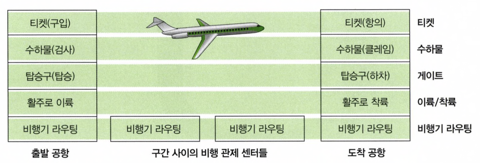
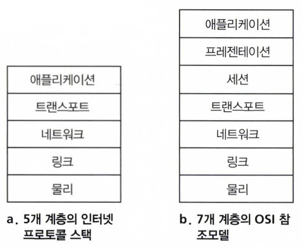
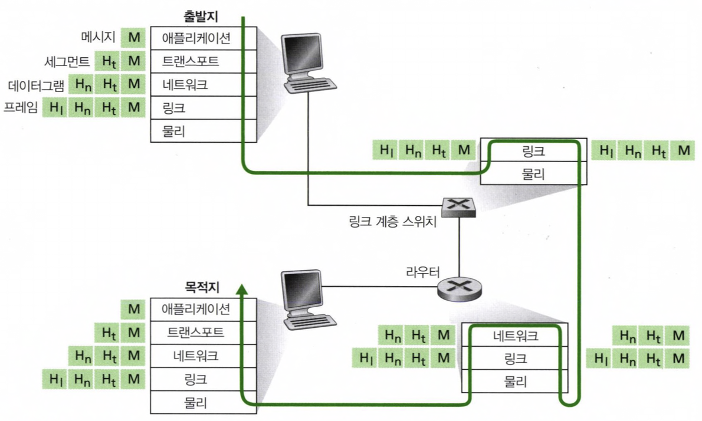

지금까지는 인터넷을 구성하는 다양한 애플리케이션과 프로토콜, 여러가지 종단 시스템과 종단 시스템 간의 연결, 라우터, 다양한 링크 수준의 매체가 있다는 것을 알 수 있었다.
그래서 이번 절에서는 이렇게 복잡한 네트워크 구조를 어떻게 조직하는가에 대해서 알아보자.

## 1.5.1 계층구조

   

네트워크 프로토콜의 설계에 대한 구조를 제공하기 위해, 네트워크 설계자는 프로토콜을 계층으로 조직한다. 그림을 보면 항공 시스템 구조에서 각각의 기능이(티켓, 수화물, 게이트, 이/착륙, 비행기 라우팅) 한 계층에 속하는 것처럼 각 프로토콜은 한 계층에 속한다.
각 계층은 그 계층 내부에서 어떤 동작을 수행하거나 직접 하위 계층의 서비스를 사용 한다. 그림으로 예시를 들어보자면, 탑승객이 티켓을 구입하게 하고, 티켓을 구입한 승객을 수화물 검사를 할 수 있도록 이동시키는 것이 내부 동작을 수행하고 하위 계층의 서비스를 이용할 수 있도록 하는 것이라고 볼 수 있겠다.

다양한 계층의 프로토콜을 모두 합하여 **프로토콜 스택(protocol stack)** 이라고 한다.

   

인터넷 프로토콜 스택은 
- 애플리케이션 계층
- 트랜스포트 계층
- 네트워크 계층
- 링크 계층
- 물리 계층 

이렇게 5개 계층으로 구성되어 있다. 

### 애플리케이션 계층
애플리케이션 계층은 네트워크 애플리케이션과 애플리케이션 계층 프로토콜이 있는 곳이다. HTTP, SMTP, FTP 같은 프로토콜을 포함하고 있으며 우리에게 친근한 도메인을 네트워크 주소로 변환하는 기능도 애플리케이션 계층의 DNS 가 도와주고 있다.
애플리케이션 계층 프로토콜은 여러 종단 시스템에 분산되어 있어서 한 종단 시스템에 있는 애플리케이션이 다른 종단 시스템에 있는 애플리케이션과 정보 패킷을 교환하는데 이 프로토콜을 사용하며 애플맄이션 계층에서의 이 정보 패킷을 우리는 메시지 라고 부른다.

### 트랜스포트 계층
트랜스포트 계층은 클라이언트와 서버 간에 애플리케이션 계층 메시지를 '전송'하는 서비스를 제공한다.

인터넷에는 TCP 와 UDP 라는 트랜스포트 프로토콜이 있으며, 이들은 메시지를 전달하는 역할을 한다. 가볍게 살펴보자면, TCP 는 연결지향형 서비스를 제공하며, 목적지로의 메시지 전달 보장과 흐름제어를 포함한다.
또한, 긴 메시지를 짧은 메시지로 나누고 혼잡제어 기능을 제공하여, 네트워크가 혼잡할 때 전송속도를 제어하는 등의 역할을 한다.

반면, UDP 프로토콜은 비연결형 서비스를 제공하며, 신뢰성, 흐름제어, 혼잡 제어를 제공하지 않는 아주 간단한 서비스이다. 
트랜스포트 계층의 패킷은 **세그먼트(segment)** 라고 부른다.

### 네트워크 계층
네트워크 계층은 한 호스트에서 다른 호스트로 **데이터그램(datagram)** 을 라우팅하는 책임을 진다. 
우편물을 배달할 때, 주소를 보고 전달하는 것 처럼 트랜스포트 계층의 프로토콜(TCP 또는 UDP)이 세그먼트와 목적지 주소를 네트워크 계층으로 전달하면 네트워크 계층은 목적지 계층의 트랜스토프 계층으로 세그먼트를 '운반'하는 서비스를 제공한다.

인터넷의 네트워크 계층은 두 가지 주요 요소를 갖는데,
IP 데이터 그램의 필드를 정의하며 종단 시스템과 라우터가 이 필드에 어떻게 동작하는지를 정의하는 프로토콜을 갖고 있다.
이 프로토콜이 바로 **1. IP 프로토콜**이다.

또한, 출발지와 목적지 사이에 데이터그램이 이동하는 경로를 결정하는 **2. 라우팅 프로토콜**을 포함한다.

### 링크 계층
네트워크 계층은 출발지와 목적지 간의 일련의 라우터라고 볼 수 있는 패킷 스위치를 통해 데이터그램을 라우트한다. 경로 상 한 노드에서 다른 노드로 패킷을 이동하기 위해 네트워크 계층은 링크 계층 서비스에 의존해야 한다.
네트워크 계층은 데이터그램을 아래 링크 계층으로 보내고, 링크 계층은 목적지를 찾아가기 위해 그 다음 노드에 전달하고, 그렇게 목적지를 찾아가다가 링크 계층은 상위 네트워크 계층으로 보내게 된다.
링크 계층 프로토콜의 예로는 이더넷, 와이파이 그리고 케이블 접속 네트워크의 DOCSIS 등이 있다.
링크 계층의 패킷은 **프레임**이라고 부른다.

### 물리 계층
물리 계층의 기능은 프레임 내부의 각 비트를 한 노드에서 다음 노드로 이동하는 것이다. 해당 계층에서 프로토콜들은 링크에 의존하고 실제 링크의 물리적인 전송매체(꼬임쌍선, 단일 모드 광케이블 등)에 의존한다.

## 1.5.2 캡슐화

   

출발지에서부터 목적지까지 메시지를 이동시키는 과정에 대해 살펴보자. 출발지 애플리케이션 계층의 메시지를 전달하고 싶을 때, 이 메시지는 트랜스포트 계층으로 내려가게 되고, 이 메세지는 트랜스포트 계층이 적절한 목적지로 보내기 위한 정보와 오류 검출 비트를 포함하여 다시 한번 캡슐화하게 된다.
이걸 세그먼트라고 부르게된다.

그 다음에 트랜스포트 계층은 세그먼트를 네트워크 계층으로 보내며, 네트워크 계층은 세그먼트를 받아 출발지와 목적지 종단 시스템 주소와 동일한 헤더 정보를 추가하여 데이터그램을 만든다.
데이터그램은 링크 계층으로  전달되고 링크 계층도 자신의 헤더 정보를 추가하여 프레임을 만든다. 

애플리케이션에서 출발한 메시지는 물리계층을 통해 스위치와 라우터로 전달되기 전에 각 계층의 헤더를 입게되면서 각 계층에서 패킷은 '헤더 필드'와 '페이로드 필드'를 가진다는 점을 알 수 있다.
(여기서 페이로드는 그 계층 상위로의 패킷이다. 다시 말하자면 세그먼트에 네트워크 계층 헤더가 붙으면 데이터그램이 되는데, 헤더가 붙기 이전인 세그먼트가 페이로드가 되겠다.)
