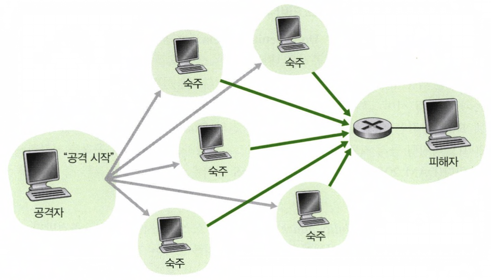

### 맬웨어(malware)
인터넷에서 데이터를 송/수신 하기 위해 인터넷에 연결을 하게 되는데, 이때 멜웨어라는 것이 섞여 들어올 수 있다.

오늘날 가장 널리 퍼져있는 맬웨어는 **자가복제**를 한다. 어쩌다 한 호스트에 영향을 미치면 그 호스트로부터 다른 호스트의 엔트리를 찾아나서고, 거기서도 또 다른 호스트의 엔트리를 찾아나가며 기하급수적으로 퍼지게 된다.

맬웨어는 두가지의 형태로 퍼질 수 있는데,
- 바이러스의 경우, 악의적인 실행 가능 코드를 포함하는 전자 메일 첨부물이 대표적인 예시가 되겠다. 일단 클릭되면, 연결된 모든 다른 수신자들에게 전송되는 형태이다.
- 웜(worm)의 경우, 직접적인 상호작용 없이 장치에 침투하는 맬웨어이다. 

### DoS(denial-of-service) 공격

   

이름에서 알 수 있듯이, DoS 공격은 네트워크, 호스트 혹은 다른 기반 구조의 요소들이 정상적인 사용자들이 사용할 수 없도록 하는 공격을 말한다.
세 가지로 분류할 수 있는데, 다음과 같다.
- 취약성 공격 : 목표 호스트에서 수행되는 공격받기 쉬운 애플리케이션 혹은 운영체제에 교묘한 메시지를 보내는 것을 포함한다. 서비스가 중단되거나 호스트의 동작 멈춤을 목적으로 두고 있다.
- 대역폭 플러딩 : 목표 호스트로 수많은 패킷을 보내서 접속 링크가 동작하지 못하게 하여 정당한 패킷들이 서버에 도달하지 못하도록 하는 공격이다.
- 연결 플러딩 : 목표 호스트에 반열림(half-open) 혹은 전열림(fully open) 된 TCP 연결을 설정하여 호스트가 가짜 연결을 처리하느라 바빠서 정상적인 연결을 받아들일 수 없게 하는 공격이다.

DoS 공격은 하나의 공격자가 하나의 시스템을 대상으로 과도한 요청을 보내는 것이라면, DDoS(Distributed Denial of Service)공격은 여러 대의 좀비 PC 가 동시에 한 서버에 요청을 보내 서비스 마비를 일으키는 복잡한 공격이다.
단일 호스트로의 공격인 DoS 보다 발견하고 방어하기가 더욱 어렵지만 오늘날 매우 흔한 공격 중 하나이다.

### 패킷 스니퍼(packet sniffer)
오늘날 우리는 WiFi 나 셀룰러 인터넷에 연결된 포켓용 장치와 같은 무선 장치를 통해 인터넷에 접속하는데, 이 무선 전송장치의 근처에 수동적인 수신자를 위치시켜서 전송되고 있는 모든 패킷의 사본을 얻을 수 있다.
여기서 이 수동적인 수신자를 **패킷 스니퍼**라고 한다.

스니퍼는 유선 환경에서도 배치될 수 있으며, 라우터나 접속 링크에 대한 접속 권한을 얻게되면 어떤 조직으로 들어가고 나오는 모든 패킷을 복사하는 스니퍼를 설치하여 민감한 정보들을 얻을 수 있게 된다.
패킷 스니퍼는 수동적이기 때문에 탐지하기가 어렵고 무선 채널로 패킷을 보낼 때 어디선가 패킷이 기록되고 있을 수 있다는 가능성을 고려해야한다. 따라서 예방하기 위한 가장 좋은 방법은 암호화를 포함하는 것이 되겠다.

### IP 스푸핑(spoofing)
거짓의 출발지 주소를 가진 패킷을 인터넷으로 보내는 능력을 IP 스푸핑이라고 하며, 한 사용자가 다른 사용자인 것처럼 행동하는 방법 중 하나이다.
이 문제를 해결하기 위해, **종단 인증** 즉, 메세지가 실제로 와야 할 곳으로부터 온 것인지를 확신할 수 있는 방법이 필요하다.
