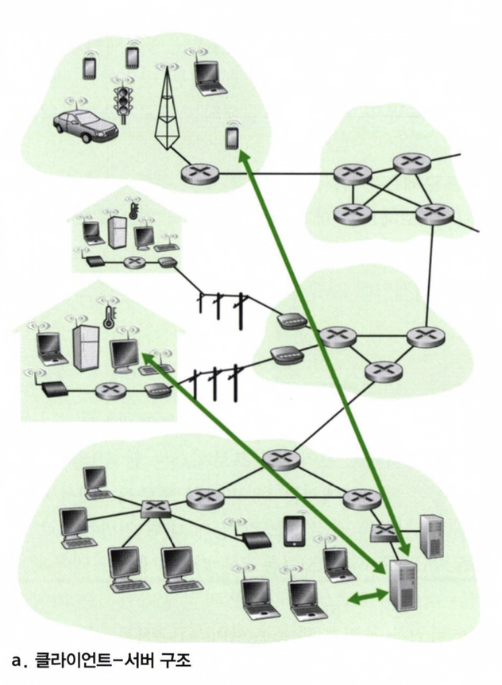
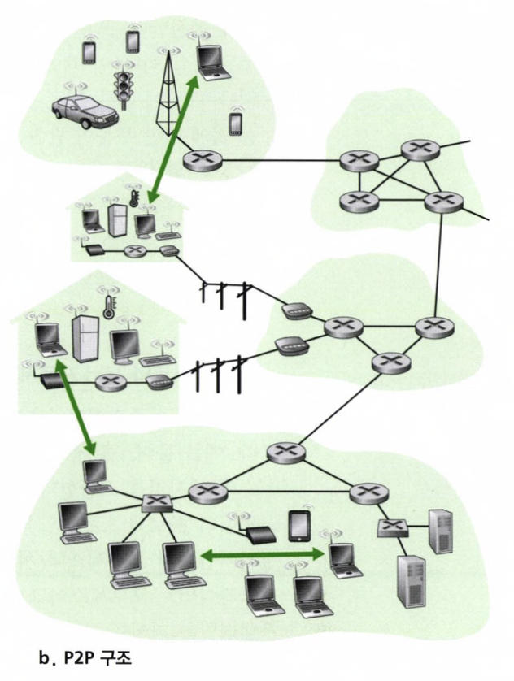
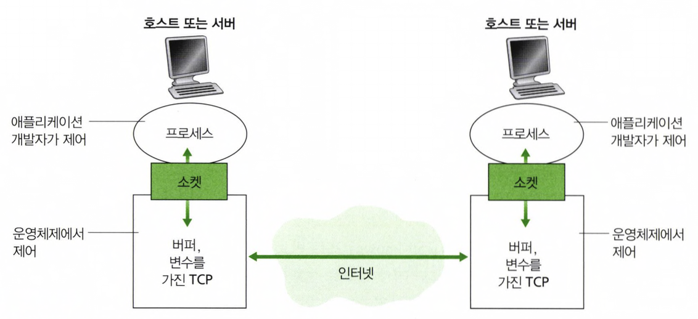

## 2.1.1 네트워크 애플리케이션의 구조
애플리케이션 구조는 애플리케이션 개발자에 의해 설계되고 애플리케이션이 다양한 종단 시스템에서 어떻게 조직되어야 하는지를 지시한다. 일반적으로 개발자는 '클라이언트-서버 구조' 혹은 'P2P 구조' 중의 하나로 작성한다.

### 클라이언트 - 서버 구조(client-server architecture)

   

항상 켜져있는 호스트를 서버라고 부르고 이 서버는 클라이언트라는 다른 많은 호스트의 요청을 받는다.
웹 서버가 클라이언트로부터 객체를 요청받으면 웹 서버는 클라이언트로 요청된 객체를 보내어 응답한다.

주목할 점은, 클라이언트들은 서로 직접적으로 통신하지 않는다. 생각해보면 2개의 브라우저가 서로 직접적으로 통신하지는 않는다!
또 다른 특징은 서버가 고정 IP 주소라는 잘 알려진 주소를 갖는다는 것이다.

클라이언트와는 다르게 서버는 항상 동작하므로 클라이언트는 서버 주소로 패킷을 보내서 항상 서버에 연결할 수 있다.

적은 수의 클라이언트가 서버에 연결할 때에는 서버가 모든 클라이언트의 요청에 대해 응답해주는 것이 가능하겠지만, 실제 상황을 생각해보면 셀 수 없이 많은 클라이언트가 하나의 서버에 요청을 보내면 그 서버가 모든 클라이언트에 대해 응답하기란 불가능하다.
그래서 우리가 알고 있는 구글이나, 아마존, 알리바바, 페이스북과 같은 인기 있는 서비스들은 하나 이상의 데이터 센터를 사용한다.

### P2P(peer-to-peer) 구조

   

P2P 구조는 켜져 있는 서버에 최소로 의존하거나 혹은 전혀 의존하지 않는다.
대신에 피어라고 하는 호스트 쌍이 '서로 직접' 통신하도록 한다. 여기서의 피어는 사용자들이 제어하는 데스트톱과 랩톱을 의미한다.
통신하는 과정에 특정 서버를 통하지 않고, 피어가 통신하기 때문에 peer-to-peer, P2P 라고 한다.
비트토렌트와 같은 파일공유, 스카이프와 같은 인터넷 전화 및 비디오 컨퍼런스 같이 트래픽 집중적인 애플리케이션들이 P2P 의 대표적인 예이다.
(어떤 어플리케이션들은 클라이언트-서버 와 P2P 요소들을 결합해서 사용하기도 한다. 사용자의 IP 를 추적할 때에는 클라이언트-서버 구조를, 사용자 간 메세지는 P2P 구조를 이용하는 식이다.)

P2P 구조의 가장 주목할 만한 특성 중 하나는 **자가 확장성(self-scalability)** 이다. 
P2P 에서는 모든 사용자가 '소비자'이자 '공급자'의 역할을 한다.
예시를 들어보자. 친구 A,B,C 가 있다고 할 때, B는 A 로 부터 '영화1' 이라는 파일을 받았다. 그러면 이제 A 뿐만 아니라 B 도 C 에게 '영화1'이라는 파일을 제공할 수 있는 공급자의 역할도 할 수 있게 되는 것이다.
클라이언트-서버 구조와는 다르게 상당한 서버 기반 구조와 서버 대역폭을 요구하지 않기에 비용 효율적이다.
그치만, 고도의 분산 구조 특성으로 인해 보안, 성능, 신뢰성에 대한 문제점 또한 가지고 있다.

## 2.1.2 프로세스 간 통신
### 클라이언트와 서버 프로세스
운영체제 용어에서 실제로 '통신'을 하는 것은 프로그램이 아니라 **프로세스** 이다. 여기서 프로세스는 종단 시스템에서 실행되는 프로그램을 의미한다.
네트워크 애플리케이션은 네트워크에서 서로 메시지를 보내는 두 프로세스로 구성이 된다. 예를 들어, 브라우저가 클라이언트 - 웹서버가 서버 라고 이름 붙이고, P2P 구조에선 파일을 내려주는 클라이언트를 서버 - 파일을 내려받은 클라이언트를 클라이언트 라고 부를 수 있겠다.

즉, 두 프로세스 간의 통신 세션에서 통신을 '초기화'(다른 프로세스와 세션을 시작하려고 접속을 초기화)하는 프로세스를 **클라이언트**라고 하고,
세션을 시작하기 위해 접속을 '기다리는' 프로세스를 **서버**라고 한다.

### 프로세스와 컴퓨터 네트워크 사이의 인터페이스
네트워크 통신을 하려면 하나의 프로세스에서 다른 프로세스로 메시지를 보내야하는데, 프로세스는 **소켓(socket)**을 통해 네트워크로 메시지를 주고받는다.
예시를 들어보자. 프로세스는 집, 소켓을 출입문이라고 하면 내가 우리집에서 친구집으로 가려면 우리집 출입문을 열고 나가서 친구집 출입문을 통해 친구집으로 들어가야한다.
메시지도 같은 방법으로 전달된다.

   

그림에서 볼 수 있듯이 소켓은 호스트 애플리케이션 계층과 트랜스포트 계층 간의 인터페이스이다. 또한, 네트워크 애플리케이션이 인터넷에 만든 프로그래밍 인터페이스이므로
API(Application Programming Interface) 라고도 한다.
애플리케이션 개발자가 트랜스포트 프로토콜을 선택하면 애플리케이션은 그 프로토콜이 제공하는 전송 서비스를 사용하여 구성된다.

### 프로세스 주소 배정
내가 친구집을 찾아가기 위해선 친구집의 주소를 알고 있어야한다. 네트워크 상에서도 마찬가지로 프로세스가 다른 프로세스로 패킷을 보내기 위해서는 수신 프로세스가 주소를 가지고 있어야한다.
1. 호스트의 주소
2. 그 목적지 호스트 내의 수신 프로세스를 명시하는 식별자

이렇게 2가지 정보가 필요하게 된다.

인터넷에서 호스트는 **IP 주소**로 식별된다. 이 정보로는 호스트를 유일하게 식별해주기만 한다.
예를 들어, IP 주소로는 광진구에 위치한 건국대학교 라는 것만 식별할 수 있을 뿐이지, 여기서 근무하는 김아무개 교수님을 찾아낼 순 없다는 의미이다.
그래서, 정확한 수신 프로세스를 찾기위해 **포트 번호**를 사용한다. 공과대학 컴퓨터공학부 컴퓨터네트워크를 강의하는 김아무개 교수 를 의미한다.
이보다 어떻게 정확할 수 있겠는가!

## 2.1.3 애플리케이션이 이용 가능한 트랜스포트 서비스

## 2.1.4 인터넷 전송 프로토콜이 제공하는 서비스

## 2.1.5 애플리케이션 계층 프로토콜

