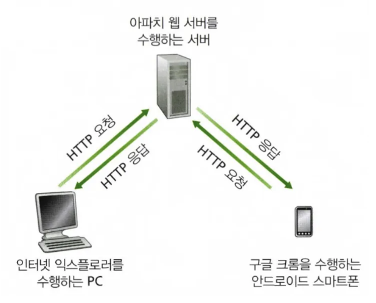
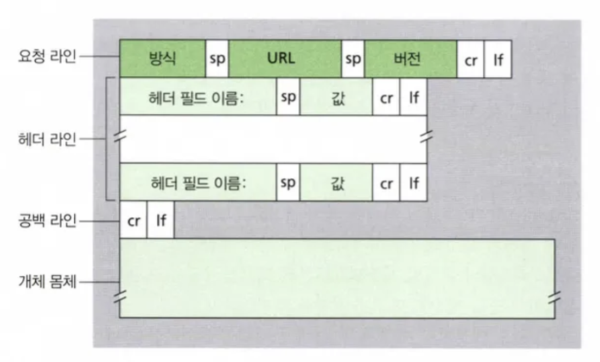
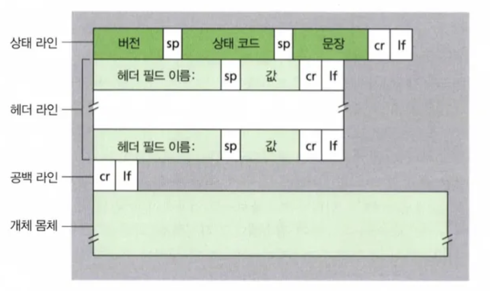
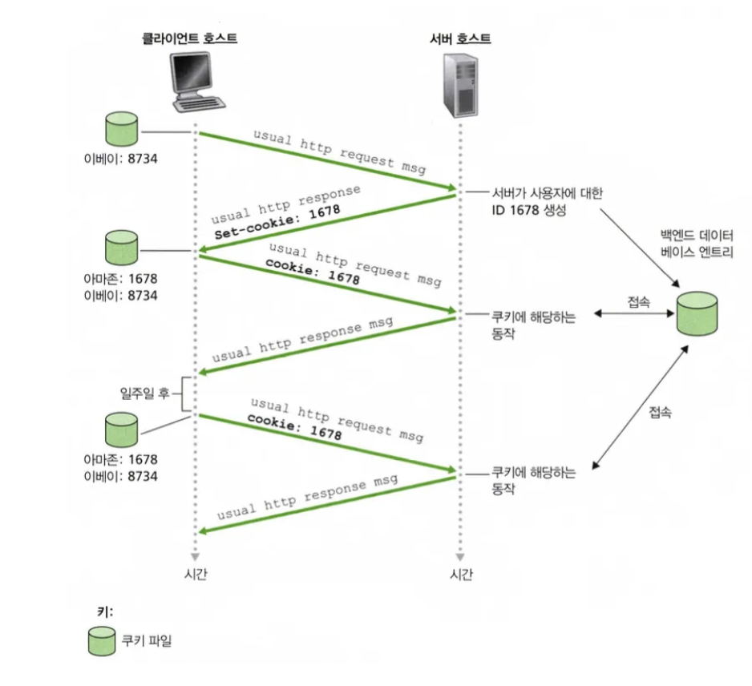
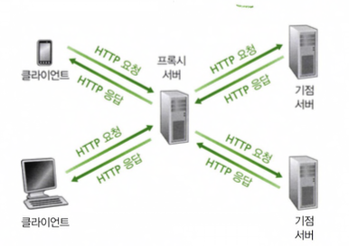
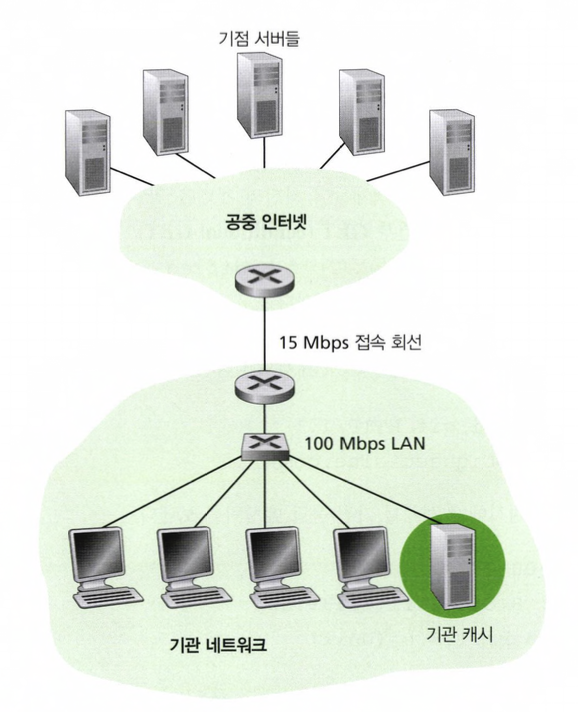

# 2.2 웹과 HTTP

## 2.2.1 HTTP 개요

웹의 애플리케이션 계층 프로토콜인 **HTTP (HyperText Transfer Protocol)**는 웹의 중심이다.

HTTP 는 **클라이언트 프로그램**과 **서버프로그램** 두 가지 프로그램으로 구현된다.

HTTP를 알아보기전에 용어를 정리해보자

- **웹 페이지**는 객체들로 구성된다.
- **객체**는 단순히 단일 URL로 지정할 수 있는 하나의 파일이다.
- **웹 페이지는 기본 HTML 파일**과 여러 참조 객체로 구성된다.
    - 예를 들어 웹 페이지가 HTML 텍스트와 5개의 JPEG 이미지로 구성되어있으면 웹 페이지는 6개의 객체를 갖고 있는 것이다.

사용자가 웹 페이지를 요청할 때, 브라우저는 페이지 내부의 객체에 대한 HTTP 요청 메세지를 서버에게 보낸다. 서버는 요청을 수신하고 객체를 포함하는 **HTTP 응답 메시지**로 응답한다.

<p align="center">
   
</p>

## 2.2.2 비지속 연결과 지속 연결

많은 인터넷 애플리케이션에서 클라이언트와 서버는 클라이언트가 일련의 요구를 하고 서버가 각 요구에 대해 응답하면서 상당한 기간 동안 통신한다. 애플리케이션과 그 애플리케이션이 어떻게 이용되는지에 따라 일련의 요구가 계속해서, 일정한 간격으로 또는 주기적으로 혹은 간헐적으로 만들어질 수 있다.

이 클라이언트-서버 상호작용이 TCP 상에서 발생할 때 애플리케이션 개발자는 중요한 결정을 할 필요가 있다

1. **각 요구/응답 쌍이 분리된 TCP 연결을 통해 보내져야 하는가?**
2. **혹은 모든 요구와 해당하는 응답들이 같은 TCP 연결상으로 보내져야 하는가?**

전자 방식의 경우 애플리케이션은  **비지속 연결(non-persistent connection)** 이라고 하고 후자 방식의 경우 **지속 연결(persistent connection)** 이라고 한다.

### 비지속 연결 HTTP

웹 페이지를 서버에서 클라이언트로 전송하는 단계를 살펴보면:

1. HTTP 클라이언트는 HTTP의 기본 포트 번호 80을 통해 서버로 TCP 연결을 시도한다.
2. HTTP 클라이언트는 1단계에서 설정된 TCP 연결 소켓을 통해 서버로 HTTP 요청 메시지를 보낸다.
3. HTTP 서버는 1단계에서 설정된 연결 소켓을 통해 요청 메시지를 받고, 지정장치로부터 요청 객체를 추출하여 HTTP 응답 메시지에 캡슐화한 후 응답 메시지를 소켓을 통해 클라이언트로 보낸다.
4. HTTP 서버는 TCP에게 TCP 연결을 끊으라고 한다(실제로는 TCP 클라이언트가 응답 메시지를 완전히 받을 때까지 연결을 끊지 않는다).
5. HTTP 클라이언트가 응답 메시지를 받으면, TCP 연결이 중단된다.

위 단계에서 서버가 객체를 보낸 후에 각 TCP 연결이 끊어지므로 비지속 연결을 사용하고 있다. 각 TCP 연결은 하나의 요청 메시지와 하나의 응답 메시지만 전송한다. **따라서 이 예에서는 사용자가 웹 페이지를 요청할 때 11개의 TCP 연결이 만들어진다.**

### 지속 연결 HTTP

비지속 연결에서 서버는 응답을 보낸 후에 TCP 연결을 그대로 유지한다. 같은 클라이언트와 서버 간의 이후 요청과 응답은 같은 연결을 통해 보내진다.

HTTP/1.1에서는 지속 연결이 기본 옵션이며, 전체 웹 페이지(기본 HTML 파일과 10개 이미지)를 하나의 지속 TCP 연결을 통해 보낼 수 있다. 또한 같은 서버에 있는 여러 웹 페이지들을 하나의 지속 TCP 연결을 통해 보낼 수 있다.

HTTP/1.1의 기본 모드는 파이프라이닝을 이용한 지속 연결을 사용한다. 최근에 HTTP/2는 같은 연결상에서 다중 요청(request)과 응답(reply)이 가능하고 이 연결 내에서 HTTP 메시지 요청과 응답의 우선순위 기법이 가능하도록 HTTP/1.1을 기반으로 제안되었다.

## 2.2.3 HTTP 메시지 포맷

HTTP 명세서는 HTTP 메시지 포맷을 정의한다. 두 가지 HTTP 메시지, 즉 "요청 메시지"와 "응답 메시지"가 있으며, 각각의 포맷은 다음과 같다.

### HTTP 요청 메시지

요청 메시지의 예시

```
GET/somedir/page.html HTTP/1.1
Host: www.someschool.edu
Connection: close
User-agent: Mozilla/5.0
Accept-language: fr
```

요청 메시지는 ASCII 텍스트로 쓰여 있고, 각 줄은 CR과 LF(carriage return & line feed)로 구분된다. 요청 메시지의 첫 줄은 요청 라인(request line)이라 부르고, 이후 줄들은 헤더 라인(header line)이라고 부른다.

요청 라인은 3개의 필드, 즉 "방식(method) 필드", "URL 필드", "HTTP 버전 필드"를 갖는다. 방식 필드는 GET, POST, HEAD, PUT, DELETE를 포함하는 여러 가지 다른 값을 가질 수 있다. HTTP 메시지의 대부분은 GET 방식을 사용하며, 브라우저가 URL 필드로 식별되는 객체를 요청할 때 사용된다.

헤더 라인에서 Host 헤더는 객체가 존재하는 호스트를 명시한다. Connection 헤더는 지속 연결 사용을 원하지 않는다는 것을 말하고 있다. User-agent 헤더는 서버에게 요청을 하는 브라우저 타입을 명시하고 있다. Accept-language 헤더는 사용자가 객체의 프랑스어 버전을 원하고 있음을 나타낸다.

POST 방식은 사용자가 폼(검색 엔진에 검색 단어를 넣을 때)을 채워 넣을 때 사용되며, 폼에 입력한 내용을 **entity body**에 포함하여 서버로 전송한다.

<p align="center">
   
</p>

### HTTP 응답 메시지

```
HTTP/1.1 200 OK
Connection : close
Date: Tue, 18 Aug 2015 15:44 04 GMT
Server: Apache/2.2.3 (CentOS)
Last-Modified: Tue, 18 Aug 2015 15:11:03 GMT
Content-Length: 6821
Content-Type: text/html
```

HTTP 응답 메시지는 다음과 같은 구조를 가진다:

- **상태 라인**: 3개 필드(프로토콜 버전, 상태 코드, 상태 메시지)로 구성
- **헤더 라인**: 6개의 헤더 라인으로 구성
- **개체 본문(entity body)**: 요청 객체(데이터)를 포함하는 부분

상태 라인은 3개 필드를 갖는데:

1. 프로토콜 버전: 서버가 HTTP/1.1을 사용하고 있음
2. 상태 코드: 요청이 성공(OK)했음을 나타냄
3. 상태 메시지: 서버가 요청 객체를 찾아서 보내고 있음을 알려줌

서버가 사용하는 주요 헤더 라인:

1. **Connection: close**: 클라이언트에게 메시지를 보낸 후 TCP 연결을 닫는데 사용함
2. **Date**: HTTP 응답이 서버에 의해 생성되고 보낸 날짜와 시간을 나타냄(객체가 생성되거나 마지막으로 수정된 시간이 아님)
3. **Server**: 메시지가 어떤 웹 서버에 의해 만들어졌는지 나타냄
4. **Last-Modified**: 객체가 생성되거나 마지막으로 수정된 시간과 날짜를 나타냄(모든 클라이언트와 네트워크 캐시에서의 객체 캐싱에 매우 중요함)
5. **Content-Length**: 송신되는 객체의 바이트 수를 나타냄
6. **Content-Type**: 객체 본체 내부의 객체가 HTML 텍스트인 것을 나타냄(객체 타입은 파일 확장자로 나타내는 것이 아니라 공식적으로 Content-Type 헤더로 나타냄)

### 주요 HTTP 상태 코드

- **200 OK**: 요청이 성공했고, 정보가 응답으로 보내짐
- **301 Moved Permanently**: 요청 객체가 영원히 이동되었음. 새로운 URL은 응답 메시지의 Location: 헤더에 나와 있음
- **400 Bad Request**: 서버가 요청을 이해할 수 없다는 일반 오류 코드임
- **404 Not Found**: 요청 문서가 서버에 존재하지 않음
- **505 HTTP Version Not Supported**: 요청 HTTP 프로토콜 버전을 서버가 지원하지 않음

<p align="center">
   
</p>

## 2.2.4 사용자와 서버 간의 상호작용: 쿠키

웹에서 HTTP 서버는 상태를 유지하지 않는다고 했다. 이것은 서버 설계를 간단하게 하고 동시에 수천 개의 TCP 연결을 다룰 수 있는 고성능의 웹 서버를 개발하도록 해주었다.

그러나 서버가 사용자 접속을 제한하거나 사용자에 따라 콘텐츠를 제공하기 원한다면   
웹 사이트가 사용자를 확인하는 것이 바람직할 때가 있다.

이 목적으로 HTTP는 쿠키(cookie)를 사용한다.

쿠키의 기능은 네 가지 요소로 구성된다.

1. HTTP 응답 메시지 쿠키 헤더 라인
2. HTTP 요청 메시지 쿠키 헤더 라인
3. 사용자의 브라우저에 사용자 종단 시스템과 관리를 지속시키는 쿠키 파일
4. 웹 사이트의 백엔드(back-end) 데이터베이스

쿠키 작동 예시:

- Susan이 처음으로 아마존 맛집에 접속함
- 서버는 ID를 생성하고(1678) Set-cookie: 헤더를 포함한 HTTP 응답을 보냄
- Susan의 브라우저가 이 쿠키 정보를 저장함
- 다음에 Susan이 아마존 사이트에 접속하면 브라우저는 Cookie: 1678 헤더 라인이 담긴 요청 메시지를 보냄
- 이를 통해 아마존 서버는 Susan의 이전 방문을 알 수 있고, 그녀에게 맞춤형 콘텐츠를 제공할 수 있음

쿠키는 사용자 식별에 사용될 수 있으며, 사이트에 처음으로 사용자가 방문하면 서버는 사용자 식별(이름)을 제공받음. 다음 세션 동안에 브라우저는 서버에 쿠키 헤더를 전달하여 서버에게 사용자를 확인함. 따라서 쿠키는 비상태 HTTP 위에서 사용자 세션 개념을 생성하는 데 이용될 수 있음.

<p align="center">
   
</p>

## 2.2.5 웹 캐싱

웹 캐시(Web cache) 또는 프록시 서버(proxy server)는 원웹서버(origin web server)를 대신하여 HTTP 요구를 충족시키는 네트워크 개체이다. 웹 캐시는 자체의 저장 디스크를 갖고 있어 최근 호출된 객체의 사본을 저장 및 보존한다.

<p align="center">
   
</p>
웹 캐시가 작동하는 방식:

1. 브라우저는 웹 캐시와 TCP 연결을 설정하고 웹 캐시에 있는 객체에 대한 HTTP 요청을 보냄
2. 웹 캐시는 객체의 사본이 자기에게 저장되어 있는지 확인함. 만일 저장되어 있다면 웹 캐시는 클라이언트 브라우저로 HTTP 응답 메시지와 함께 객체를 전송함
3. 만약 웹 캐시에 객체가 없다면, 웹 캐시는 원웹서버(www.someschool.edu)로 TCP 연결을 설정함. 그리고 나서 웹 캐시는 자기와 서버 간의 TCP 연결로 객체에 대한 HTTP 요청을 보냄
4. 원웹서버가 객체를 수신할 때, 객체를 로컬 저장장치에 복사하고 클라이언트 브라우저에 HTTP 응답 메시지와 함께 객체의 사본(클라이언트 브라우저와 웹 캐시 사이에 이미 설정된 TCP 연결을 통해)을 보냄

웹 캐시는 서버가 아니라 클라이언트로서 중요 역할을 함. 일반적으로 웹 캐시는 ISP가 구입하고 설치함. 예를 들어, 대학교는 캠퍼스 네트워크에 웹 캐시를 설치하고 모든 캠퍼스의 브라우저가 이 캐시로 요청을 보내도록 설정함. 또한 컴캐스트(comcast)와 같은 주요 가정 ISP는 하나 이상의 캐시를 네트워크상에 설치하고 설정된 캐시를 가리키도록 브라우저를 미리 설정함.

웹 캐시의 이점:

1. 주변, 기관(회사나 대학)은 자주 대역폭을 개선할 필요가 없게 되어 비용을 줄일 수 있다.
2. 웹 캐시는 인터넷 전체의 웹 트래픽을 실질적으로 줄임으로써 모든 애플리케이션을 위한 성능을 개선한다.
3. 클라이언트의 요구에 대한 응답 지연을 줄일 수 있다. 특히 클라이언트와 원웹 서버 사이의 병목 대역폭이 클라이언트와 캐시 사이의 병목 대역폭에 비해 매우 작을 때 더욱 효과적이다.
4. 인터넷과 캐시 사이에 높은 속도의 연결이 설정되어 있고(예로 그러하듯이) 캐시가 요청된 객체를 가지고 있다면, 캐시는 그 객체를 클라이언트로 매우 신속하게 전달할 수 있다.

응답 지연(총 시간)은 LAN 지연과 접속 지연(라우터 간의 지연), 인터넷 지연의 합과 같다. 이에 이 지연을 알아보기 위해 대략적인 계산을 해 보자. LAN(1.4.2절 참조)의 트래픽 강도는 다음과 같다:

```
(15요청/초) · (1 Mbit/요청)/(100 Mbps) = 0.15
```

접속 회선(인터넷 라우터에서 기관 라우터 사이)의 트래픽 강도는 다음과 같다:

```
(15요청/초) · (1 Mbit/요청) / (15 Mbps) = 1
```

일반적으로 LAN의 트래픽 강도 0.15는 많아야 수십 msec의 지연을 야기하므로 LAN 지연을 무시할 수 있다.

그러나 1.4.2절에서 언급한 것처럼 트래픽 강도가 1에 가까워지면(그림 2.12) 접속 회선의 경우와 같이 회선의 지연은 매우 커지고 한없이 증가한다.

따라서 요청을 만족시키기 위한 평균 응답 시간은 대략 몇 분이 걸리므로 기관 사용자에게 적합하지않다.

어떻게든 이것은 분명히 해결되어야 한다.

한 가지 가능한 방법은 접속률을 15 Mbps에서 100 Mbps로 늘리는 것이다.

이 방법은 두 라우터 간의 전송 지연을 무시할 수 있는 수준인 0.15까지 접속 회선의 트래픽 강도를 낮추게 된다.

이 경우에 총 응답지연(즉, 인터넷 지연)은 대략 2초이다. 그러나 이러한 해결책은 기관이 접속 회선을 15 Mbps에서 100 Mbps로 개선해야 하므로 많은 비용이 들어간다.

다른 해결 방법, 즉 접속 회선을 증설하지 않고 기관 네트워크에 웹 캐시를 설치하는 방법에 대해서 생각해 보자.

<p align="center">
   
</p>

이 방법은 그림 위 그림에 설명되어 있다. 적중률(캐시가 만족시킨 요청비율)은 일반적으로 0.2~0.7이다.

설명을 위해 이 기관에서는 캐시가 0.4의 적중률을 제공한다고 가정하자. 캐시와 클라이언트가 고속 LAN에 연결되어 있으므로 요청의 40%는 캐시에 의해 즉시(10 msec 이내) 만족된다. 하지만 여전히 60%의 요청은 원웹 서버에 의해 만족되어야 한다. 그러나 요청된 객체의 60%만 접속 회선을 통과하므로 트래픽 강도는 1.0에서 0.6으로 감소한다. 일반적으로 0.8 미만의 트래픽 강도는 작은 지연(15 Mbps 회선에 수십 msec 정도)에 속한다. 이 지연은 2초의 인터넷 지연에 비하면 무시될 수 있다. 그러므로 이동을 고려한 평균 지연은 다음과 같다:

```
0.4 · (0.01초) + 0.6 · (2.01초)
```

이것은 1.2초가 조금 넘는 지연이다. 따라서 이 두 번째 해결 방법은 첫 번째 방법보다 낮은 응답 시간을 가지며 기관이 인터넷을 위한 회선을 증설할 필요가 없다.
